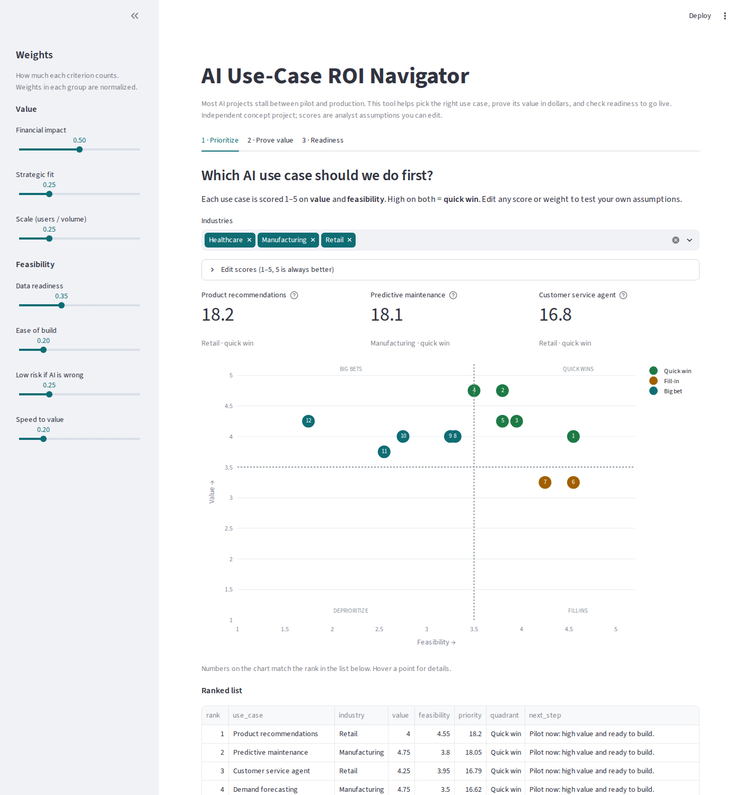
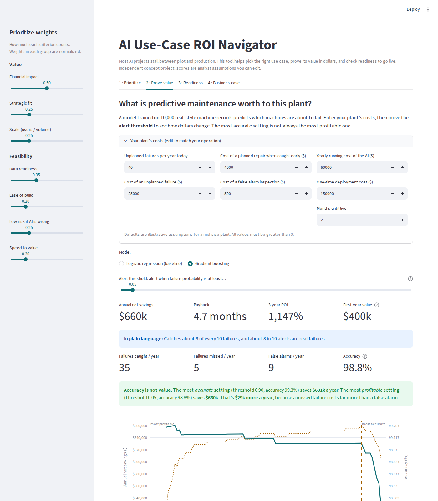
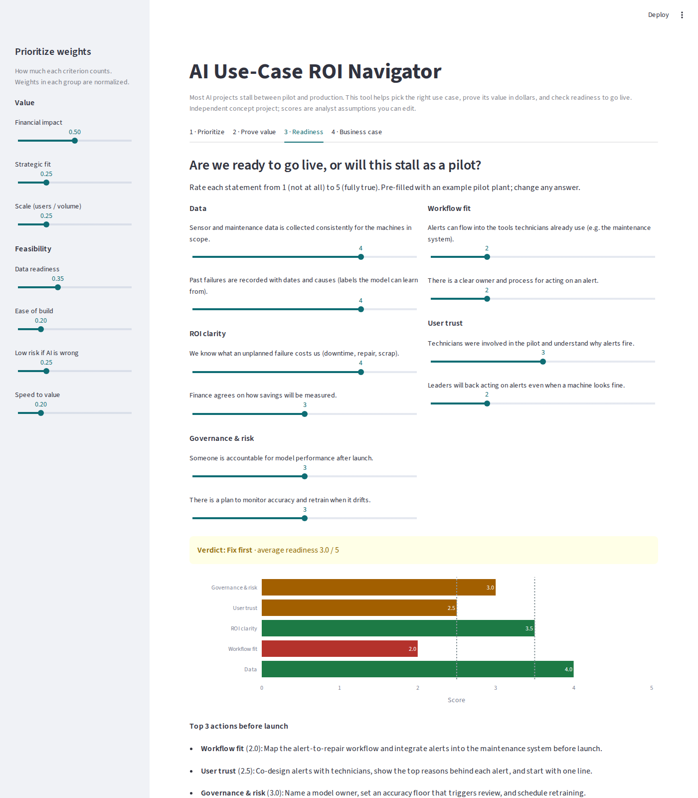
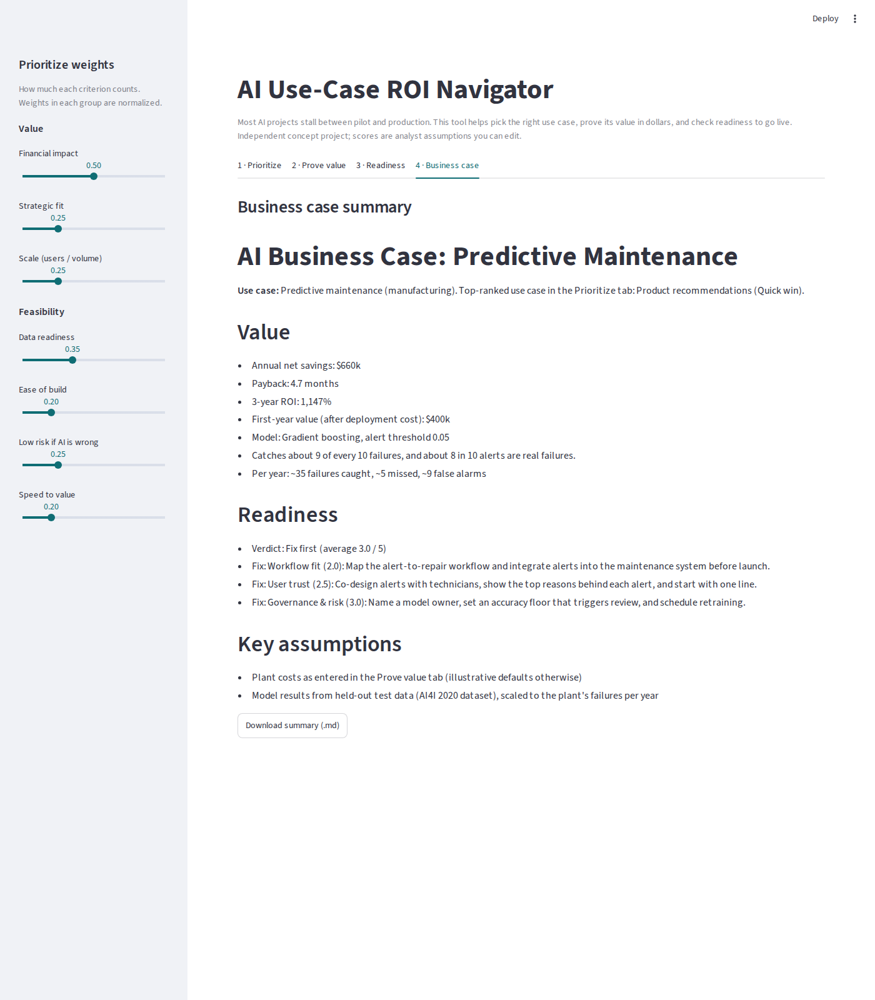

# AI Use-Case ROI Navigator

> Most teams judge AI models by accuracy. This tool judges them by dollars.

Most AI projects stall between pilot and production: companies pick projects on hype, judge models by accuracy instead of business value, and launch before they're ready. The ROI Navigator walks an operations leader through four steps:

| Tab | Question it answers |
|---|---|
| **1 · Prioritize** | Which AI use case should we do first? Scores 12 use cases on value vs feasibility. |
| **2 · Prove value** | What is it worth? Tunes a real predictive-maintenance model for **dollars saved, not accuracy**. |
| **3 · Readiness** | Are we ready to go live? 10-question scorecard with a Go / Fix first / Not ready verdict. |
| **4 · Business case** | One-page summary to share with finance (downloadable). |

*Independent concept project. Use-case scores and plant costs are illustrative assumptions and can be edited in the app.*

## Key result (default assumptions)
On 3,000 machine records the model never saw during training, a gradient-boosting model:
- catches **~86% of failures** with **~80% of alerts being real**
- yields **~$660K annual net savings** for a plant with 40 failures a year, with a **~4.7-month payback**
- **The most accurate setting is not the most profitable.** Tuning the alert threshold for dollars instead of accuracy saves **~$29K more per year**, because a missed failure ($25K) costs far more than a false alarm ($500).

| Prioritize | Prove value |
|---|---|
|  |  |
| **Readiness** | **Business case** |
|  |  |

## How it works
- **Prioritization:** weighted 1–5 scores. Value = financial impact, strategic fit, scale. Feasibility = data readiness, ease of build, low risk, speed to value. Weights are adjustable.
- **Model:** AI4I 2020 dataset (10,000 records, 339 failures). Features: temperatures, speed, torque, tool wear, plus engineered power, temperature difference and wear × torque. Failure-mode columns are excluded to avoid leakage. Logistic regression (explainable baseline) vs gradient boosting; stratified 70/30 split.
- **Dollars:** test-set catch, miss and false-alarm rates are scaled to the plant's failures per year. Savings = cost of failures without AI − (planned repairs + missed failures + false alarms + running cost).
- **Readiness:** 5 dimensions (data, workflow fit, ROI clarity, user trust, governance). Go = average ≥ 3.5 and no dimension below 2.5.

Business analysis docs (personas, use cases, 13 user stories with acceptance criteria, validation) are in [`docs/solution_design.md`](docs/solution_design.md).

## Run locally
```bash
pip install -r requirements.txt
streamlit run app.py
pytest            # optional: run the tests
```

## Data
Matzka, S. (2020). *AI4I 2020 Predictive Maintenance Dataset*. UCI Machine Learning Repository. Licensed CC BY 4.0.

## Author
Chaitali Shekar · MS Engineering Management, NC State University
